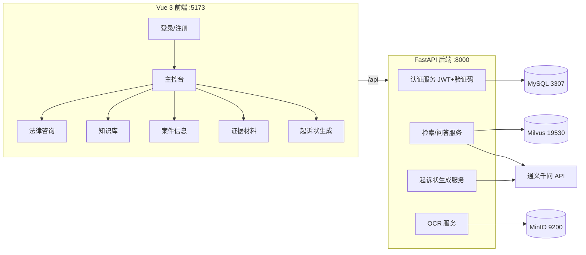
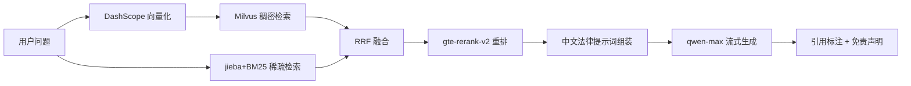

# 民事纠纷诉状生成与咨询 RAG 系统

基于法律知识库的民事纠纷**诉状生成**与**法律咨询**全栈系统。面向标的较小、事实与证据相对清晰的民事纠纷，
根据用户提供的案件信息与证据材料，检索相关法律法规、司法解释及类案案例，辅助生成起诉状，并支持法律条文查询、诉讼流程咨询等问答。

> ⚖️ **免责声明**：本系统由 AI 生成的内容仅供参考，不构成正式法律意见，具体案件建议咨询执业律师。

---

## 技术栈

| 层 | 选型 |
|----|------|
| 前端 | Vue 3 + Vite + Element Plus + Pinia + Vue Router + axios |
| 后端 | FastAPI + Uvicorn + SQLAlchemy(async) + Pydantic v2 |
| 关系数据库 | MySQL 8.0（库 `legal_rag`，端口 **3307**） |
| 向量数据库 | Milvus 2.4（端口 19530） |
| 对象存储 | MinIO（端口 9200/9201） |
| 大模型 / 向量 / 重排 | 通义千问 DashScope API（qwen-max / text-embedding-v3 / gte-rerank） |
| OCR | PaddleOCR（阶段 3 接入） |
| 测试 | pytest + pytest-asyncio + httpx |
| 日志 | loguru（控制台 + 文件轮转） |

---

## 系统架构



---

## 目录结构

```
RagDemo/
├── backend/                # FastAPI 后端
│   ├── app/
│   │   ├── main.py         # 应用入口（生命周期、CORS、健康检查）
│   │   ├── core/           # config / logging / security / captcha
│   │   ├── db/             # session（异步 SQLAlchemy）
│   │   ├── models/         # ORM 模型（User…）
│   │   ├── schemas/        # Pydantic 请求/响应
│   │   └── api/            # 路由（auth…）
│   ├── config/             # config.example.yaml（模板） / config.yaml（本地，gitignore）
│   └── tests/              # pytest 测试
├── frontend/               # Vue 3 前端
│   └── src/{views,layouts,components,router,stores,api,assets}
├── docker-compose.yml      # MySQL + Milvus 栈 + MinIO
├── data/                   # 示例法律法规 / 案例（测试数据）
├── pyproject.toml          # 后端依赖（uv 管理）
└── README.md
```

---

## 快速开始

### 1. 启动基础设施（MySQL / Milvus / MinIO）

```bash
docker compose up -d
```

| 服务 | 容器名 | 端口 |
|------|--------|------|
| MySQL | legal-rag-mysql | 3307 |
| Milvus | milvus-standalone | 19530 / 9091 |
| 应用 MinIO | legal-rag-minio | 9200(API) / 9201(控制台) |

### 2. 配置

```bash
cp backend/config/config.example.yaml backend/config/config.yaml
# 编辑 config.yaml，填入你的 DashScope api_key（阶段 2 起需要）
```

### 3. 启动后端

```bash
uv sync                       # 安装依赖（Python 3.12）
uv run uvicorn backend.app.main:app --reload --port 8000
# 接口文档：http://127.0.0.1:8000/docs
```

### 4. 启动前端

```bash
cd frontend
npm install
npm run dev                   # http://localhost:5173
```

### 5. 运行测试

```bash
uv run python -m pytest backend/tests/ -v
```

---

## 更新日志

### 阶段 1（2026-07-15）：项目骨架 + 用户认证 + 基础设施 ✅

本阶段搭建了完整的前后端工程骨架、用户认证体系与容器化基础设施。

**已实现功能**

| 模块 | 说明 |
|------|------|
| 🔐 用户注册 | 账号 / 密码 / 确认密码 / 图形验证码 4 字段，两次密码一致校验、账号唯一校验 |
| 🔐 用户登录 | 账号 / 密码 / 图形验证码 3 字段，签发 JWT |
| 🖼️ 图形验证码 | Pillow 生成、内存 TTL 存储、一次性校验、点击刷新 |
| 🏠 主控台 | 登录后功能导航（法律咨询/知识库/案件信息/证据/起诉状），全局免责声明条 |
| ⚙️ 基础设施 | docker-compose 一键启动 MySQL / Milvus / MinIO |
| 🧪 测试 | 13 个 pytest 用例全部通过 |

**页面预览（结构）**

```
┌─────────────────────────────────────────┐   ┌──────────────────────────────────┐
│           登录 / 注册（深蓝渐变）           │   │  侧边导航 │      主控台             │
│   ┌───────────────────────────────┐     │   │  首页     │  ⚠ AI 生成仅供参考       │
│   │  账号  [____________]          │     │   │  法律咨询 │  欢迎，xxx               │
│   │  密码  [____________]          │     │   │  知识库   │  ┌─────┐┌─────┐┌─────┐  │
│   │  验证码 [______] [ 图片 ]       │     │   │  案件信息 │  │咨询 ││知识库││案件 │  │
│   │        [   登  录   ]          │     │   │  证据材料 │  └─────┘└─────┘└─────┘  │
│   └───────────────────────────────┘     │   │  起诉状   │  ⚖ 免责声明条           │
└─────────────────────────────────────────┘   └──────────────────────────────────┘
```

**验收结果**

- ✅ 后端 pytest：`13 passed`
- ✅ 真实 MySQL 全链路：注册 → 登录 → 获取当前用户 均 200/201
- ✅ 前端构建成功；dev server 正常提供页面，`/api` 代理到后端联通
- ✅ 路由守卫：未登录访问受保护页跳转登录页

**技术要点**

- 配置集中于 `config.yaml`（缺失时回退 `config.example.yaml`，保证无密钥也可启动/测试）
- 密码使用 bcrypt 哈希；JWT 使用 python-jose
- 日志经 loguru 统一输出到控制台与 `logs/app.log`（按天轮转，保留 14 天）
- 测试使用内存 SQLite + 依赖覆盖，无需真实基础设施即可运行

### 阶段 2（2026-07-16）：知识库 RAG + 法律咨询流式问答 ✅

本阶段交付知识库全链路（上传→解析→切块→向量化→检索）与法律咨询对话（SSE 流式 + 法条引用）。

**已实现功能**

| 模块 | 说明 |
|------|------|
| 📚 知识库管理 | 多知识库创建/删除（全局共享），文档上传（PDF/Word/MD/TXT），可配置切块大小/重叠、稠密或混合检索 |
| 🔄 文档解析 | 后台任务：MinIO 存原件 → 提取文本 → 按句边界切块 → DashScope 向量化 → 写入 Milvus，状态实时轮询 |
| 👀 知识库预览 | 文档块分页查看、在线编辑（保存自动重新向量化）、删除（双端同步） |
| 🔍 混合检索 | 稠密（Milvus HNSW/COSINE）+ 稀疏（jieba+BM25）→ RRF 融合 → gte-rerank-v2 重排 |
| 💬 法律咨询 | 会话新建/重命名/删除；知识库多选；模型与推理参数（温度/topP/max tokens/历史轮数）可调；SSE 流式输出 |
| ⚖️ 可追溯性 | 提示词强制引用规范全称+条文序号+[n] 来源标注；引用来源可展开查看；服务端统一追加免责声明 |
| 🧪 测试 | 新增 28 个用例（解析/检索/知识库/对话），累计 41 个全部通过 |

**RAG 检索流程**



**端到端冒烟验证（真实 DashScope + Milvus + MySQL + MinIO）**

- ✅ 上传《民法典》节选 → 解析 done、5 块入 Milvus
- ✅ 提问"民间借贷的诉讼时效是多久" → SSE 流式返回，引用 [1] 指向民法典节选
- ✅ 回答包含《中华人民共和国民法典》第一百八十八条及免责声明
- ✅ 混合检索 + 重排链路全通（rerank 失败自动回退融合排序）

### 阶段 3（规划中）：案件信息填写 + 证据 OCR + 起诉状生成

### 阶段 4（规划中）：测试完善与整体打磨
